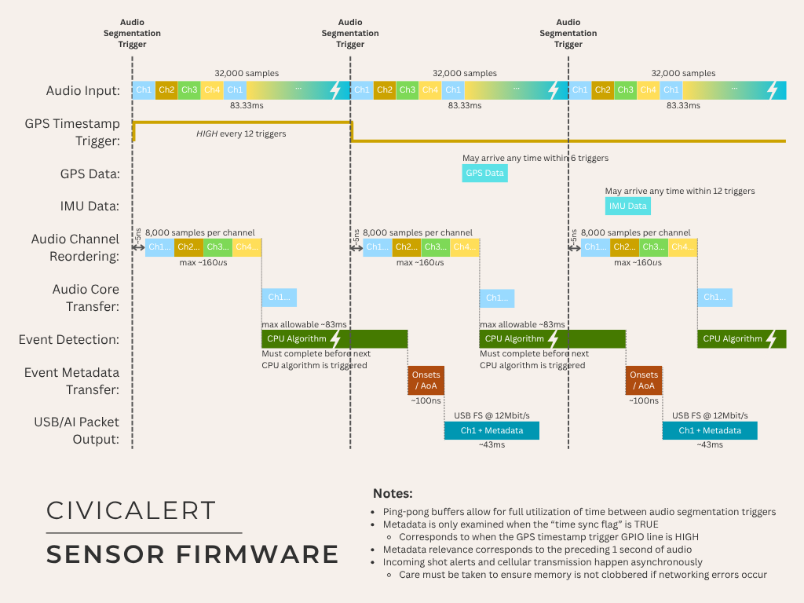

# CivicAlert Firmware Repository

This repository contains the firmware necessary to program a CivicAlert sensor device. The design targets
an STMicroelectronics [STM32H745](https://www.st.com/en/microcontrollers-microprocessors/stm32h745zi.html)
dual-core microcontroller and will not run on hardware other than the CivicAlert gunshot sensor.

The CivicAlert gunshot sensor is a self-contained PCB which utilizes four audio channels, a digital
compass and IMU, GNSS satellite data, and a state-of-the-art AI-based classification model to detect
gunshots in its vicinity. Relevant event information and evidential audio clips can be transferred to
a cloud server for futher processing using a dedicated cellular-based Internet of Things (IoT) network.


## Getting Started

There are two ways to get started with this repo, depending on how you intend to interact with it.
If you plan to make changes to the firmware or develop further functionality, continue with
[Setting Up a Development Environment](#setting-up-a-development-environment); however, if
you only need to flash existing firmware onto new CivicAlert devices, skip to the
[Preparing for Flashing](#preparing-for-flashing) section.


### Setting up a Development Environment

1. Clone this repo on your local machine
2. Download and install [STM32CubeIDE](https://www.st.com/en/development-tools/stm32cubeide.html)
3. Open STM32CubeIDE
4. Click `File->Import->General->Existing Projects into Workspace`
5. Select the repo root directory in the import dialog box
6. Ensure that 3 CivicAlert projects are showing in the "Projects" area
7. Click `Finish`

In the `Project Explorer` pane, you should see a top-level project called "CivicAlert" which contains
two sub-projects: "CivicAlert_CM4" and "CivicAlert_CM7". These sub-projects contain firmware for the
two cores of the STM32H745 microcontroller, each of which must be flashed separately.

**Important Note: There is also a file in the root project called `CivicAlert.ioc` which contains the
graphical project configuration for both cores. If you open this file and make any changes, it will
re-create a number of project files and may overwrite important pieces of the source code, including
the `main.c` files for both cores. Do not edit or make changes to this file unless you know what you
are doing and have backed up any source code changes first.**

To test or debug the firmware, click the small down-arrow next to the green bug icon in the toolbar to
expose a menu of debugging tasks. Choose the appropriate item to flash the CivicAlert microcontroller
and automatically step into the debugger:

* **CivicAlert_CM7 Debug Standalone**: Build, flash, and step into the debugger for *only* the CM7 core
* **CivicAlert_CM4 Debug Standalone**: Build, flash, and step into the debugger for *only* the CM4 core
* **CivicAlert_CM7 Debug**: Build and flash both the CM4 and CM7 firmware, then step into the debugger for the CM7 core
* **CivicAlert_CM4 Debug**: Step into the debugger for the CM4 core without re-flashing the firmware
* **CivicAlert_CM7 Debug, CM4 Release**: Build and flash the CM4 core in "Release" mode, build and flash the CM7 core in "Debug" mode, then step into the debugger for the CM7 core
* **CivicAlert_CM7 Release, CM4 Debug**: Build and flash the CM7 core in "Release" mode, build and flash the CM4 core in "Debug" mode, then step into the debugger for the CM4 core


### Preparing for Flashing

To flash, you will need an [STLink-V3MINIE](https://www.digikey.com/en/products/detail/stmicroelectronics/STLINK-V3MINIE/16284301)
programmer and a [Kyocera AVX](https://www.digikey.com/en/products/detail/kyocera-avx/009159010061911/11307835)
open-ended card edge connector. You must also download and install the
[STM32CubeProgrammer](https://www.st.com/en/development-tools/stm32cubeprog.html). This will install
both a graphical and a command-line tool for flashing STM32 microcontrollers. You may need to add the
command-line tool to your `PATH` to make it accessible from a terminal. For MacOS, for example, the
following directory should be added to the `PATH`:

```
/Applications/STMicroelectronics/STM32Cube/STM32CubeProgrammer/STM32CubeProgrammer.app/Contents/MacOs/bin
```

To flash the firmware using the graphical tool:

1. Download and unzip the most recent firmware release from the [Releases](https://github.com/VU-Civic/firmware/releases) page
2. Open the `STM32CubeProgrammer` application
3. Connect a CivicAlert sensor device to your computer using the STLink-V3MINIE programmer
4. Click the green "Connect" button at the top-right corner of the application using the default SWD configuration settings
5. Access the "Erasing and Programming" tool by clicking the second icon on the lefthand toolbar
6. Click "Browse" next to the "File path" and select "CivicAlert_CM4.elf" from the firmware release you downloaded above
7. Ensure that the "Start address" says `0x08100000` and the "Verify programming" box is checked
8. Click "Start programming" to flash the CM4 firmware
9. Click "Browse" next to the "File path" and select "CivicAlert_CM7.elf" from the firmware release you downloaded above
10. Ensure that the "Start address" says `0x08000000` and the "Verify programming" box is checked
11. Click "Start programming" to flash the CM7 firmware
12. Power cycle the CivicAlert sensor device to ensure that all firmware is running from a known state

To flash the firmware using the command-line tool:

1. Download and unzip the most recent firmware release from the [Releases](https://github.com/VU-Civic/firmware/releases) page
2. Open up a terminal and ensure that `make` is installed
3. `cd` into the directory of the firmware release you downloaded above
4. Type `make flash` to flash the firmware onto the CivicAlert sensor device
5. Power cycle the CivicAlert sensor device to ensure that all firmware is running from a known state


## Firmware Design Overview

The firmware was designed with four primary goals in mind:

1. Implement as much functionality as possible using hardware peripherals, direct memory access (DMA), and background processes
2. Keep the CPU in deep-sleep mode as long as possible, waking on interrupt infrequently and only when necessary
3. Separate computational concerns cleanly between the two available processing cores
4. Provide as many computational cycles as possible for the high complexity tasks of event detection, angle of arrival calculation, and audio encoding

To address the first two design goals, all computational tasks are time-aligned and triggered
from incoming audio samples at 96kHz. In other words, it is the reception of predefined numbers of
audio samples that trigger subsequent tasks and not real-time clocks or hardware-based timers.
Specifically, a hardware "SAI" peripheral is coupled with DMA to collect incoming 4-channel audio
samples in the background and automatically trigger an "MDMA" hardware peripheral to change the
state of an external GPIO line upon reception of 32,000 audio samples. The GPIO line states are
stored in a 12-value circular buffer, with all values being 0 except for the 1st value which is
a 1. This GPIO line is connected to a "hardware timestamp trigger" line on an external GNSS chip
which can determine the precise nanosecond-scale time when this GPIO line toggles from low (0)
to high (1). Since this line is automatically toggled high by hardware upon every 12th reception
of 32,000 samples, this provides an almost 0-latency way of timestamping reception of the first
sample of 1 continuous second of audio.

After setting the GPIO timestamp trigger line to the correct value, the MDMA peripheral triggers
another MDMA peripheral to both move and re-order the 32,000 received samples of 4-channel audio,
such that each audio channel is stored contiguously directly into the 0-wait-state cache of the
CM7 (high performance) core of the microcontroller. This is done completely in the background by
hardware, and upon completion, two additional tasks are triggered:

1. The CM7 CPU core is awoken to begin event detection and angle of arrival calculation for any detected events
2. Another MDMA hardware transfer is initiated to copy a single audio channel from the CM7 cache to a location accessible by the CM4 core

This awaking of the CM7 core represents the first CPU interaction required by the firmware, and it
also represents the *only* functionality that runs on the CM7 core, providing up to ~83ms of time
for this core to complete its event detection algorithms before the next batch of audio is ready
for processing. Upon completion of event detection, any detected events are sent to the CM4 core
via a hardware interrupt, and likewise, when the MDMA transfer of the single audio channel from CM7
to CM4 is complete, a CM4 hardware interrupt will occur. This allows the CM4 core to store the
received data into an appropriate location for further future processing.

Completely asynchronously to the above, a 9-DOF IMU will transfer the current orientation of the
sensor in an Earth-oriented coordinate frame using quaternions once per second. This transfer
happens using I2C and a hardware BDMA peripheral in the background and may occur at any time.
Similarly, an external GNSS chip will transfer the current location of the device twice per
second, along with a notification of the precise timestamp of the most recent rising edge on the
GPIO trigger line. This data is sent at 2Hz to absolutely ensure that the GPIO timestamp is
received *at least* once per second, regardless of any clock drift or timing inconsistencies
between the audio sampling process and the GNSS chip.

Since all of these various processes take place using hardware triggers, the CM4 core is typically
woken up only twice per handling of each 32,000-sample audio chunk, once when the CM7-to-CM4 audio
buffer transfer is complete and once when the CM7 event detection algorithm is complete. When the
CM4 core is awoken, it checks to see if 1) the CM7-to-CM4 core transfer has completed and 2) the
event detection algorithm has completed. If so, then an audio data packet is transferred over
USB for debugging and monitoring purposes and over SPI to an external AI processing chip for
classification of the detected events as either gunshots or some other type of acoustic event.
This packet includes the most recent metadata about the location and orientation of the sensor,
as well as the timestamp of the first audio sample in the previous second of audio. This metadata
also contains a boolean flag which is set to `true` if the GNSS GPIO trigger line is currently
high when the packet is transmitted. This flag is used to indicate that the timestamp in the
metadata accurately corresponds to the first sample in the previous second of audio. If this flag
is not set, then the timestamp in the metadata should be ignored.

Whenever the external AI chip finishes its classification procedure, it will transmit a shot alert
packet back to the CM4 core using SPI and DMA, and the CM4 core will transmit this packet out over
the cellular network using UART and DMA.

The following graphic outlines the data flow described above from a logical point of view, where
reddish-orange boxes indicate operations that take place entirely in hardware, green boxes take
place entirely on either the CM4 or CM7 CPU core, and all other colored boxes represent data
being transferred between the various hardware entities. All items encircled by a dotted line
represent data sources that are external to the STM32H745 microcontroller:


Another useful way to visualize the flow of data in this firmware design is temporally, as shown
in the following graphic. This shows the typical timing requirements for the flow of data through
the various hardware components, as well as the maximum amount of time available for completion
of the various CPU-based algorithms:


